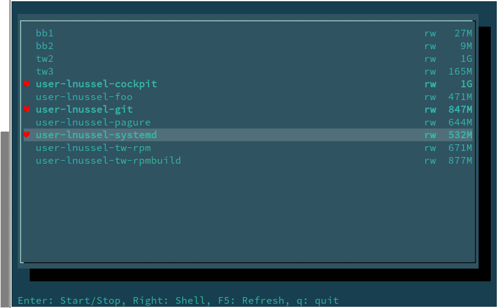

# TUI for machined

Notcurses based text user interface for machined. Currently allows
to navigate through images with the cursor keys. Enter starts and
stops machines. Cursor right starts a shell into the machine.

Please follow the instructions at
https://en.opensuse.org/Systemd-machined to import images into
machined

To be albe to use this tool as user some polkit rules are needed.
See https://en.opensuse.org/Systemd-machined#Using_containers_as_user

